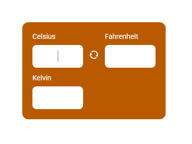

# Conversor-Temperatura
 

## Descrição
O projeto Conversor-Temperatura consiste em um sistema de conversão de temperatura desenvolvido com JavaScript, HTML, CSS. Esse projeto foi criado para estudos pessoais.

## Funcionalidades
O Conversor de Temperatura oferece as seguintes funcionalidades:
- Conversão de temperatura entre Celsius, Fahrenheit e Kelvin.
- Interação via interface com os usuarios.

## Exemplo de Interação do Usuário
Aqui está um exemplo de interação do usuário ao executar o programa:

  

Nessa interface o usuario escreve a temperatura inicial e recebe a conversão das outras duas temperaturas como resultado.

